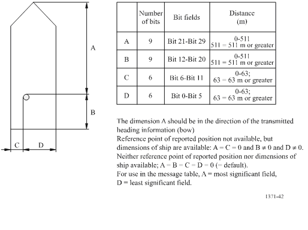

# Fem-IoT
FemIoT repo for WP5


## Emission application

### Background

TODO: Add technical background

### Technical details

This application computes the emissions produced by the ships given as input.
The defaulta parameters are defined in the code and in the `runpipe.sh` file.

The sample gaps are interpolated if there are two samples in, at least, 15
minutes. If there are gaps that are greater, the samples are not interpolated in
between. We interpolate a sample each 10 seconds.

The input data and the result output path is stored in the CSV path defined in `runpipe.sh`.

Run using app/runpipe.sh inside the docker machine.

At the end of the execution, a folder named **output** is created, containing
the emission summaries in csv and lineplots.

## Container infrastructure and data

TODO: Describe the two ways of working with the application.

### Building the container

```
docker build -t fem-iot .
```

### Build and run the testing framework
Inside of `docker_hadoop` folder:
```
docker-compose up
```

Notice that it will take a while to boot.


### Data setup 

TODO: Some intro

#### Data format

##### Input format

There are two types of data input: AIS messages and ship registry data. Both
data inputs are described below.

###### AIS
The input data should contain the following attributes obtained from AIS
messages:


- nombre: Ship's name
- imo: IMO ID
- mmsi: MMSI ID
- size_a: Size A (check diagram below)
- size_b: Size B (check diagram below)
- size_c: Size C (check diagram below)
- size_d: Size D (check diagram below)
- eslora: Overall length (meters)
- manga: Beam (meters)
- draught: Draft (meters)
- sog: Speed over Ground/Current speed (knots)
- cog: Course over Ground (degrees)
- rot: Current rotation (degrees)
- heading: Ships true heading (degrees)
- navstatus: Navigational status (e.g. Underway using engine)
- typeofshipandcargo: Type of ship and cargo being transported. Check the types
  [here](https://api.vtexplorer.com/docs/ref-aistypes.html)
- latitude: Current latitude (degrees)
- longitude: Current longitude (degrees)
- fechahora: Timestamp. Format: YYYY-MM-DD hh:mm:ss



Size attributes (A,B,C and D) in AIS messages. International Telecommunications
Union Recommendation [ITU-R M.1371-5](https://www.itu.int/rec/R-REC-M/e).

| nombre     | imo | mmsi | size_a | size_b | size_c | size_d | eslora | manga | draught | sog  | cog | rot | heading | navstatus | typeofshipandcargo | latitude         | longitude | fechahora           |
| ------     | --- | ---- | ------ | ------ | ------ | ------ | ------ | ----- | ------- | ---  | --- | --- | ------- | --------- | ------------------ | --------         | --------- | ---------           |
| Magic Ship | 0   | 33   | 20     | 170    | 5      | 20     | 190    | 25    | 5.5     | 19.8 | 358 | 0   | 356     | 0         | 60                 | 40.7606616666667 | 2.21904   | 2016-01-16 16:37:11 |


###### Ship registry data

Ship registry data should contain the following attributes:

- imo: IMO ID
- name: Ship name
- type: Ship type
- me_stroke: Main Engine stroke stages (integer)
- me_rpm: Main Engine RPM
- prop_rpm: Propeller RPM
- loa: Length Over All (meters)
- lbp: Length Between Parallels (meters)
- l: Length (meters)
- b: Beam (meters)
- t: Draft (meters)
- los: Length over surface as defined by Hollenbach (1997,1998) (meters) 
- lwl: Waterline length (meters)
- ta: Draft at the aft perpendicular (meters)
- tf: Draft at the forward perpendicular (meters)
- bulbous_bow: Wether the ship has a bulbous bow or not (boolean)
- n_thru: Number of thrusters (integer)
- inst_pow_me: Total power installed as Main Engine (Kw)
- n_inst_me: Number of Main Engines installed (integer)
- single_pow_me: Power of a single Main Engine (Kw)
- eng_type: Type of engine as defined in the registry [Oil, Gas, Turbine]
- inst_pow_ae: Total power installed as Auxiliary Engine (Kw)
- design_speed: Maximum speed of the ship (knots)
- n_ref_teu: Number of refrigerated TEUs (integer)
- n_cabin: Number of cabins (integer)
- serv_pow_me: Total service power of the Main Engine (Jalkanen 2009, 80% of the installed power)
- serv_single_pow_me: Service power a single Main Engine (Jalkanen 2009, 80% of the installed power)
- ae_rpm: Auxiliary Engine RPM
- n_screw: Number of screws (integer)
- n_rudd: Number of rudders (integer)
- n_brac: Number of brackets (integer)
- n_boss: Number of bossings (integer)
- design_draft: wether the ship has design draft or not (boolean)
- build_year: year in which the ship was built (integer)
- fuel_type: type of fuel the ship uses [YY, DF, RF, LG, GB]
- vapour_recovery: wether the ship has a vapour recovery or not (boolean)
- mg_total_pow: Main Generator total power (Kw)
- ag_total_pow: Auxiliary Generator total power (Kw)
- ae_stroke: Auxiliary Engine stroke stages (integer)
- mg_pow: Main Generator power (Kw)
- ag_pow: Auxiliary Generator power (Kw)
- trozzi_fuel_type: Type of fuel following Trozzi 2010 Table 7 [MDO, BFO, HFO, LNG]
- hermes_type: Type of the ship following the nomenclature of HERMESv3 [OT, FE, CR, GC, DC, LC, TU, RO, CC, OC]
- trozzi_type: Type of the ship following the nomenclature of Trozzi 2010 [Others, Passenger, General cargo, Dry bulk carriers, Liquid bulk ships, Tugs, Fishing, Ro Ro cargo, Container]
- eng_type2: Engine type regarding speed (diesel, steam and gas) [HSD, MSD, SSD, ST, GT]
- naei_sfoc_me: Specific Fuel Oil Consumtion for Main Engine following NAEI methodology (g/kWh)
- naei_sfoc_ae: Specific Fuel Oil Consumtion for Auxiliary Engine following NAEI methodology (g/kWh)
- steam_sfocbase_me: Specific Fuel Oil Consumtion for Main Engine following STEAM methodology (g/kWh)
- steam_sfocbase_ae: Specific Fuel Oil Consumtion for Auxiliary Engine following STEAM methodology (g/kWh)
- waterline: Waterline length (meters)
- dp
- wet_surf_a3: Wet surface a3 coefficient following Hollenbach 1998 approach
- wet_surf_k: Wet surface k coefficient following Hollenbach 1998 approach
- cr_nofn: Resistance coefficient without Froude Number following Hollenbach 1998 approach
- qpc: Quasi-propulsive constant as defined in Jalkanen 2012


|imo|name|type|me_stroke|me_rpm|prop_rpm|loa|lbp|l|b|t|los|lwl|ta|tf|bulbous_bow|n_thru|inst_pow_me|n_inst_me|single_pow_me|eng_type|inst_pow_ae|design_speed|n_ref_teu|n_cabin|serv_pow_me|serv_single_pow_me|ae_rpm|n_screw|n_rudd|n_brac|n_boss|design_draft|build_year|fuel_type|vapour_recovery|mg_total_pow|ag_total_pow|ae_stroke|mg_pow|ag_pow|trozzi_fuel_type|hermes_type|trozzi_type|eng_type2|naei_sfoc_me|naei_sfoc_ae|steam_sfocbase_me|steam_sfocbase_ae|waterline|dp|wet_surf_a3|wet_surf_k|cr_nofn|qpc|
|---|----|----|---------|------|--------|---|---|-|-|-|---|---|--|--|-----------|------|-----------|---------|-------------|--------|-----------|------------|---------|-------|-----------|------------------|------|-------|------|------|------|------------|----------|---------|---------------|------------|------------|---------|------|------|----------------|-----------|-----------|---------|------------|------------|-----------------|-----------------|---------|--|-----------|----------|-------|---|
|0|Magic Ship|Passenger/Ro-Ro Cargo Ship|4|500|180|190.5|177|190.5|26|6.3|183.75|183.75|6.3|6.3|TRUE|2|18006|3|9003|Oil|3420|21.4|0|96|14404.8|7202.4|514|2|2|2|2|TRUE|2010|LG|FALSE|NA|7830|4|NA|5840|LNG|FE|Passenger|MSD|166|166|260|220|183.75|4.87587943144907|4331.82903|2307.28172268374|0.654888360161353|0.600525575478299|

##### Output format

|imo|nombre|sog|latitude|longitude|time|type|hermes_type|me_rpm|ae_rpm|inst_pow_me|inst_pow_ae|design_speed|sfoc_me|sfoc_ae|last_move|d_lat|d_lon|amp_v|trans_p_me|trans_p_ae|sox_fact_me|sox_fact_ae|co2_fact_me|co2_fact_ae|nox_fact_me|nox_fact_ae|sox_me|sox_ae|co2_me|co2_ae|nox_me|nox_ae|
|---|------|---|--------|---------|----|----|-----------|------|------|-----------|-----------|------------|-------|-------|---------|-----|-----|-----|----------|----------|-----------|-----------|-----------|-----------|-----------|-----------|------|------|------|------|------|------|
|0|Magic Ship|19.700000762939453|40.76514434814453|2.2187983989715576|1452962280|Passenger/Ro-Ro Cargo Ship|FE|500|514|18006.0|3420.0|21.399999618530273|166|166|0|0.0|0.0|0.0|10485.126|3420.0|0.33165503|0.33165503|517.04|517.04|12.984299|12.912785|0.05795741|0.018904336|90.35382|29.47128|2.2690334|0.73602873|


#### Standalone

Copy the `../test_data/` CSVs into the desired HDFS path. For example:
```
IHS="hdfs:///user/ubuntu/emis_femiot/data/anon_ihs_test.csv"
AIS="hdfs:///user/ubuntu/emis_femiot/data/anon_2016-01.csv"
```

**Make sure that this and the output folders exists before running.**


#### With the testing framework

```
docker exec datanode mkdir /data
docker cp ../test_data/anon_ihs_test.csv datanode:/data
docker cp ../test_data/anon_2016-01.csv datanode:/data
```

```
docker exec -ti datanode /bin/bash
hdfs dfs -mkdir /data
hdfs dfs -put /data/*.csv /data/
```


## Execution

`runpipe.sh` script has the following parameters:

- `HDFS_SERVER`: HDFS server endpoint. Example: "hdfs://172.15.1.10:9000"
- `IHS`: Path to the IHS dataset inside of HDFS. Example: "hdfs:///data/anon_ihs_test.csv"
- `AIS`: Path to the IHS dataset inside of HDFS. Example: "hdfs:///data/anon_2016-01.csv"
- `TMP`: Path for the intermediate calculations. Example: "hdfs:///data/calc/"
- `OUT`: Path where the output is stored. Example: "hdfs:///data/calc_emis"

You should input the parameters in the following way:
```
docker run --name fem-iot -it --network=femiot --ip 172.15.1.05 fem-iot /bin/bash
./runpipe.sh HDFS_SERVER="ServerURL" IHS="IHSFile" AIS="AISFile" TMP="TMPFolder" OUT="OUTFolder
```

With the example infrastructure:
```
./runpipe.sh HDFS_SERVER="hdfs://172.15.1.10:9000" IHS="hdfs:///data/anon_ihs_test.csv" AIS="hdfs:///data/anon_2016-01.csv" TMP="hdfs:///data/calc/" OUT="hdfs:///data/calc_emis"
```

### Running without network

If you want to use the standalone mode, the only thing that changes is the
docker run itself. The files should point to somewhere in the container's
filesystem.

```
docker run --name fem-iot -it fem-iot /bin/bash
./runpipe.sh # With the proper configuration
```

## Output

After executing `runpipe.sh` the resulting emissions will be available in the
folder configured as output (`OUT`) folder. The plots will be available in
`output/plot`. 

The results show aggregations of the emissions by day, day of the week, week and month.

### Output data format

Depending on which model is used (STEAM or STEAM2), the output will be
different. In the following subsections we define the output for each model.
Notice that there are some shared attributes with the input. This is done for
validation purposes.

#### STEAM

- imo: IMO id
- nombre: Ship name
- sog: Speed over Ground/Current speed (knots)
- latitude: Current latitude (degrees)
- longitude: Current longitude (degrees)
- time: Timestamp in seconds from Epoch (integer)
- type: Ship type (string)
- hermes_type: Type of the ship following the nomenclature of HERMESv3 [OT, FE, CR, GC, DC, LC, TU, RO, CC, OC]
- me_rpm: Main Engine RPM
- ae_rpm: Auxiliary Engine RPM
- inst_pow_me: Total power installed as Main Engine (Kw)
- inst_pow_ae: Total power installed as Auxiliary Engine (Kw)
- design_speed: Maximum speed of the ship (knots)
- sfoc_me: Used Specific Fuel Oil Consumtion for Main Engine (g/kWh)
- sfoc_ae: Used Specific Fuel Oil Consumtion for Auxiliary Engine (g/kWh)
- last_move: How many samples we have received since the ship moved last time (integer)
- d_lat: Deprecated
- d_lon: Deprecated
- amp_v: Deprecated
- trans_p_me: Transient Main Engine power. Power being used now. (kWh)
- trans_p_ae: Transient Auxiliary Engine power. Power being used now. (kWh)
- sox_fact_me: Used SOx emission factor for the Main Engine (g/kWh)
- sox_fact_ae: Used SOx emission factor for the Auxiliary Engine (g/kWh)
- co2_fact_me: Used CO2 emission factor for the Main Engine (g/kWh)
- co2_fact_ae: Used CO2 emission factor for the Auxiliary Engine (g/kWh)
- nox_fact_me: Used NOX emission factor for the Main Engine (g/kWh)
- nox_fact_ae: Used NOX emission factor for the Auxiliary Engine (g/kWh)
- sox_me: Amount of SOx emitted by the Main Engine (unit specified in the config)
- sox_ae: Amount of SOx emitted by the Auxiliary Engine (unit specified in the config)
- co2_me: Amount of CO2 emitted by the Main Engine (unit specified in the config)
- co2_ae: Amount of CO2 emitted by the Auxiliary Engine (unit specified in the config)
- nox_me: Amount of NOx emitted by the Main Engine (unit specified in the config)
- nox_ae: Amount of NOx emitted by the Auxiliary Engine (unit specified in the config)

|imo|nombre|sog|latitude|longitude|time|type|hermes_type|me_rpm|ae_rpm|inst_pow_me|inst_pow_ae|design_speed|sfoc_me|sfoc_ae|last_move|d_lat|d_lon|amp_v|trans_p_me|trans_p_ae|sox_fact_me|sox_fact_ae|co2_fact_me|co2_fact_ae|nox_fact_me|nox_fact_ae|sox_me|sox_ae|co2_me|co2_ae|nox_me|nox_ae|
|---|------|---|--------|---------|----|----|-----------|------|------|-----------|-----------|------------|-------|-------|---------|-----|-----|-----|----------|----------|-----------|-----------|-----------|-----------|-----------|-----------|------|------|------|------|------|------|
|0|Magic Ship|19.700000762939453|40.76514434814453|2.2187983989715576|1452962280|Passenger/Ro-Ro Cargo Ship|FE|500|514|18006.0|3420.0|21.399999618530273|166|166|0|0.0|0.0|0.0|10485.126|3420.0|0.33165503|0.33165503|517.04|517.04|12.984299|12.912785|0.05795741|0.018904336|90.35382|29.47128|2.2690334|0.73602873|


#### STEAM2

- imo: IMO id
- nombre: Ship name
- sog: Speed over Ground/Current speed (knots)
- latitude: Current latitude (degrees)
- longitude: Current longitude (degrees)
- time: Timestamp in seconds from Epoch (integer)
- l: Length (meters)
- b: Beam (meters)
- t: Draft (meters)
- qpc: Quasi-propulsive constant as defined in Jalkanen 2012
- wet_surf_k: Wet surface k coefficient following Hollenbach 1998 approach
- wet_surf_a3: Wet surface a3 coefficient following Hollenbach 1998 approach
- cr_nofn: Resistance coefficient without Froude Number following Hollenbach 1998 approach
- n_screw: Number of screws (integer)
- n_cabin: Number of cabins (integer)
- n_ref_teu: Number of refrigerated TEUs (integer)
- design_draft: wether the ship has design draft or not (boolean)
- waterline: Waterline length (meters)
- type: Ship type (string)
- hermes_type: Type of the ship following the nomenclature of HERMESv3 [OT, FE, CR, GC, DC, LC, TU, RO, CC, OC]
- me_rpm: Main Engine RPM
- ae_rpm: Auxiliary Engine RPM
- inst_pow_me: Total power installed as Main Engine (Kw)
- inst_pow_ae: Total power installed as Auxiliary Engine (Kw)
- design_speed: Maximum speed of the ship (knots)
- sfoc_me: Used Specific Fuel Oil Consumtion for Main Engine (g/kWh)
- sfoc_ae: Used Specific Fuel Oil Consumtion for Auxiliary Engine (g/kWh)
- nulls: Number of attributes without value (integer)
- model: Estimation model used for this sample [STEAM, STEAM2]
- last_move: How many samples we have received since the ship moved last time (integer)
- d_lat: Deprecated
- d_lon: Deprecated
- amp_v: Deprecated
- trans_p_me: Transient Main Engine power. Power being used now. (kWh)
- trans_p_ae: Transient Auxiliary Engine power. Power being used now. (kWh)
- sox_fact_me: Used SOx emission factor for the Main Engine (g/kWh)
- sox_fact_ae: Used SOx emission factor for the Auxiliary Engine (g/kWh)
- co2_fact_me: Used CO2 emission factor for the Main Engine (g/kWh)
- co2_fact_ae: Used CO2 emission factor for the Auxiliary Engine (g/kWh)
- nox_fact_me: Used NOX emission factor for the Main Engine (g/kWh)
- nox_fact_ae: Used NOX emission factor for the Auxiliary Engine (g/kWh)
- sox_me: Amount of SOx emitted by the Main Engine (unit specified in the config)
- sox_ae: Amount of SOx emitted by the Auxiliary Engine (unit specified in the config)
- co2_me: Amount of CO2 emitted by the Main Engine (unit specified in the config)
- co2_ae: Amount of CO2 emitted by the Auxiliary Engine (unit specified in the config)
- nox_me: Amount of NOx emitted by the Main Engine (unit specified in the config)
- nox_ae: Amount of NOx emitted by the Auxiliary Engine (unit specified in the config)

|imo|nombre|sog|latitude|longitude|time|l|b|t|qpc|wet_surf_k|wet_surf_a3|cr_nofn|n_screw|n_cabin|n_ref_teu|design_draft|waterline|type|hermes_type|me_rpm|ae_rpm|inst_pow_me|inst_pow_ae|design_speed|sfoc_me|sfoc_ae|nulls|model|last_move|d_lat|d_lon|amp_v|trans_p_me|trans_p_ae|sox_fact_me|sox_fact_ae|co2_fact_me|co2_fact_ae|nox_fact_me|nox_fact_ae|sox_me|sox_ae|co2_me|co2_ae|nox_me|nox_ae|
|---|------|---|--------|---------|----|-|-|-|---|----------|-----------|-------|-------|-------|---------|------------|---------|----|-----------|------|------|-----------|-----------|------------|-------|-------|-----|-----|---------|-----|-----|-----|----------|----------|-----------|-----------|-----------|-----------|-----------|-----------|------|------|------|------|------|------|
|0|Magic Ship|19.700000762939453|40.76514434814453|2.2187983989715576|1452962280|190.5|26.0|6.300000190734863|0.6005255579948425|2307.28173828125|4331.8291015625|0.6548883318901062|2|96|0|true|183.75|Passenger/Ro-Ro Cargo Ship|FE|500|514|18006.0|3420.0|21.399999618530273|166|166|0|2|0|0.0|0.0|0.0|13412.695|1038.0|0.33165503|0.33165503|517.04|517.04|12.984299|12.912785|0.074139796|0.005737632|115.581665|8.944792|2.902574|0.22339118|


